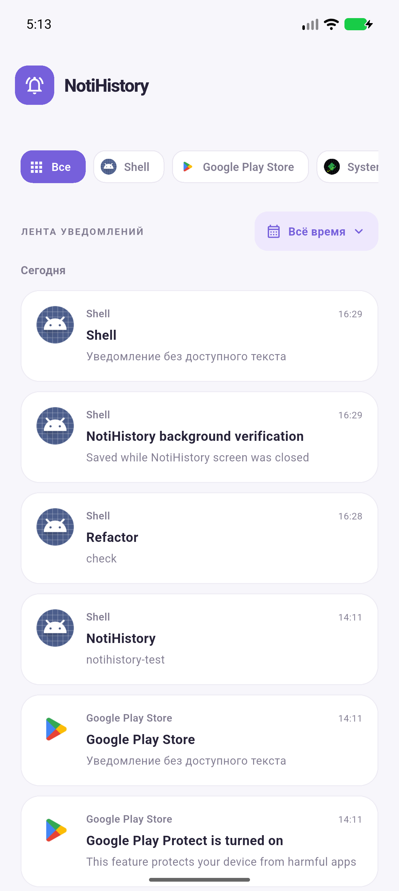
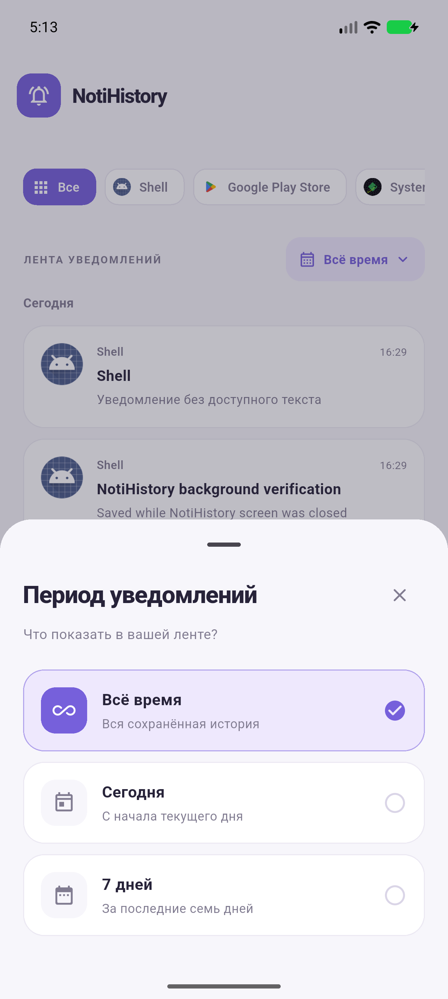

<div align="center">

# 🔔 NotiHistory

**Уведомление исчезло из шторки? Его история остаётся у вас.**

Локальная история уведомлений Android с поиском, фильтрами и удобным просмотром.


<a href="https://github.com/mu1zi47/NotiHistory/releases">
  
</a>

[Возможности](#-возможности) · [Установка](#-установка) · [Для разработчиков](#-для-разработчиков)

</div>

> Кнопка открывает раздел **Releases**. Для установки выберите файл `.apk` в **Assets** нужного релиза. Если релизов ещё нет или APK не прикреплён, приложение можно собрать из исходников по инструкции ниже.

## ✨ О приложении

NotiHistory сохраняет доступное содержимое уведомлений после того, как вы разрешите доступ в настройках Android. Можно вернуться к сообщению, найти нужную запись и прочитать полный текст — даже если уведомление уже убрали из шторки.

История хранится на устройстве в SQLite. В release-сборке нет интернет-разрешения, облака, рекламы и аналитики; резервное копирование базы отключено.

## 📱 Интерфейс

<div align="center">
  
  &nbsp;&nbsp;
  
</div>

## ✨ Возможности

| | Что умеет NotiHistory |
| --- | --- |
| 🔔 **История** | Сохраняет уведомления, в том числе после закрытия экрана приложения. |
| 🔎 **Поиск** | Ищет по приложению, package name, заголовку и тексту. Поддерживает кириллицу и поиск без учёта регистра. |
| 🗂️ **Фильтры** | Показывает записи выбранного приложения за всё время, сегодня или последние 7 дней. |
| 📄 **Подробности** | Открывает полный текст уведомления и позволяет скопировать его. |
| 🧹 **Очистка** | Позволяет удалить отдельную запись свайпом или всю историю с подтверждением. |
| ⚡ **Лента** | Загружает историю страницами и обновляется при новых уведомлениях. |
| 🔒 **Приватность** | Хранит данные локально, без отправки на сервер. |

## 🚀 Установка

1. Нажмите **Скачать APK** и скачайте файл `.apk` из раздела **Assets** релиза.
2. Откройте файл на Android и, если система попросит, разрешите установку из этого источника.
3. Запустите **NotiHistory** и нажмите **Включить сохранение**.
4. В системных настройках разрешите приложению **доступ к уведомлениям**.
5. Вернитесь в приложение: новые уведомления начнут попадать в историю.

На некоторых телефонах для APK вне магазина сначала нужно разрешить **ограниченные настройки** в системной карточке приложения. Доступ к уведомлениям — специальный доступ Android; разрешение на отправку собственных уведомлений для сохранения истории не требуется.

### Что важно знать

- Сохранение уведомлений других приложений работает только на **Android**.
- Уведомления, удалённые до предоставления доступа, восстановить нельзя.
- Принудительная остановка, ограничения системы или отозванный доступ могут прервать сохранение. После принудительной остановки снова откройте приложение.
- Android может скрывать чувствительный текст, включая одноразовые коды.
- Старые записи не удаляются автоматически: очистить историю можно в приложении.

## 🛠 Для разработчиков

Нужны Flutter с совместимым Dart SDK (`^3.13.5` в `pubspec.yaml`) и Android SDK.

```sh
flutter pub get
flutter run
```

Сборка APK:

```sh
flutter build apk --release
```

Готовый файл: `build/app/outputs/flutter-apk/app-release.apk`.

Текущая release-конфигурация использует debug-подпись. Для публикации в магазине настройте собственный ключ подписи и уникальный `applicationId`.

Проверки:

```sh
flutter analyze
flutter test
```

[Отчёт о проверках](docs/verification.md)

<details>
<summary><strong>Архитектура, ограничения платформы и интеграционные проверки</strong></summary>

## Как работает сохранение

`NotificationCaptureService` — нативный Android `NotificationListenerService`, который Android привязывает после явного разрешения пользователя. Он пишет в SQLite через единую последовательную очередь. Flutter общается с ним через MethodChannel/EventChannel; для записи Flutter engine не нужен. Нет foreground service, периодического опроса, WorkManager или закреплённого уведомления.

Сохраняется доступный текст каждой опубликованной версии уведомления, включая big text, text lines и MessagingStyle. Групповые сводки и текущие уведомления также сохраняются. Повторное обновление одного активного уведомления с тем же содержимым не создаёт дубликат. После удаления уведомления его повторное появление считается новым. При переподключении сервиса доступны только уведомления, ещё находящиеся в шторке.

Время в ленте — время сохранения, в подробностях — время публикации Android. Очистка удаляет всю историю, в том числе скрытую фильтрами, но сохраняет хеши активных уведомлений, чтобы они не возвращались при переподключении.

## Ограничения платформы

- Только Android может читать уведомления других приложений таким способом. На iOS/web/desktop отображается объяснение недоступности функции.
- Абсолютная гарантия сохранения невозможна: принудительная остановка, отозванное разрешение, ограничения производителя, отсутствие места или недоступность сервиса могут вызвать пропуски. После force-stop необходимо снова открыть приложение; иногда нужно повторно включить доступ.
- Не восстанавливает уведомления, удалённые до предоставления доступа. После перезагрузки доступность сервиса зависит от Android и разблокировки устройства.
- Android 15+ может скрывать OTP и другой чувствительный текст. Приложение не обходит это ограничение.
- На некоторых телефонах для APK вне магазина нужно разрешить «ограниченные настройки» в системной карточке приложения, прежде чем включать доступ к уведомлениям.
- Нет автоматического удаления старых записей: размер базы растёт, пока пользователь не очистит историю.
- Release пока использует debug-подпись шаблона. Для магазина нужен собственный signing key и уникальный applicationId.

Документация: [NotificationListenerService](https://developer.android.com/reference/android/service/notification/NotificationListenerService), [ограничения Android 15](https://developer.android.com/about/versions/15/behavior-changes-all#otp-redaction).

## Проверка

```sh
flutter analyze
flutter test
flutter build apk --debug
```

## Структура кода

```text
lib/
  main.dart                    # Только запуск
  app.dart                     # Сборка приложения и зависимостей
  core/
    theme/                     # Цвета и тема
    formatting/                # Даты и время
  features/history/
    domain/                    # Модели и интерфейс репозитория
    data/                      # Android-каналы и LRU-кэш иконок
    application/               # Контроллер запросов, фильтров и lifecycle
    presentation/              # Экран, диалоги, отдельные виджеты
```

Android: `MainActivity` подключает `HistoryPlatformBridge`; `NotificationAccess` отвечает за доступ, `NotificationContent` — за извлечение текста, `AppIconLoader` — за иконки, `HistoryStore` — за SQLite. `NotificationCaptureService` не зависит от Flutter.

Оптимизации: UI не перезапрашивает данные по событиям, пока приложение скрыто; ввод объединяется задержкой 280 мс, события — окном 400 мс. Следующие страницы не пересчитывают количество совпадений и сводку приложений. Поиск и переключение фильтров используют уже загруженную сводку. Старые ответы не перезаписывают новый поиск или очищенную историю. При обычном обновлении сохраняются уже загруженные страницы.

Запись уведомлений, чтение истории и обработка иконок выполняются в отдельных очередях. SQLite работает в режиме WAL; версия схемы 2 добавляет индексы времени и пары приложение/время без удаления истории. Кэш иконок Flutter ограничен 80 элементами, нативный кэш — 2 МБ; имена приложений кэшируются на 5 минут. Полнотекстовый поиск по подстроке по-прежнему сканирует подходящие записи: FTS не добавлен, поскольку изменил бы семантику поиска.

`test/` проверяет интерфейс, debounce, устаревшие ответы, очистку при незавершённом чтении, пагинацию, lifecycle и LRU-кэш. Нативные интеграционные проверки находятся в `android/app/src/androidTest`: дедупликация, кириллица, очистка, пагинация, повторное открытие и миграция v1 → v2. Они используют отдельную тестовую базу.

Запуск Android-проверок на эмуляторе:

```sh
cd android
./gradlew :app:assembleDebug :app:assembleDebugAndroidTest
adb -s emulator-5560 install -r ../build/app/outputs/apk/debug/app-debug.apk
adb -s emulator-5560 install -r ../build/app/outputs/apk/androidTest/debug/app-debug-androidTest.apk
adb -s emulator-5560 shell am instrument -w com.example.noti_history.test/com.example.noti_history.HistoryInstrumentation
```

На macOS без системного JDK задайте `JAVA_HOME` из установленной Android Studio. Серийный номер эмулятора уточняется через `adb devices`.

Ручной сценарий: включить доступ, отправить уведомление из другого приложения, проверить поиск и фильтр; закрыть экран NotiHistory, отправить ещё одно уведомление и вернуться. Открыть полный текст, проверить сохранение после повторного запуска, отмену очистки и подтверждённую очистку. После очистки текущие уведомления не должны появляться снова без изменения текста.

</details>
